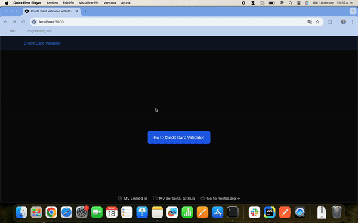

# Credit Card Validator with Next.js + Node + Express

## Getting started

To start please make sure you are running both client and server projects

- The client folder contains the next project
- The server folder contains the Node + Express

Both projects use Typescript.

Every project has **README.md** instructions.

The result after running both projects should look like this:

